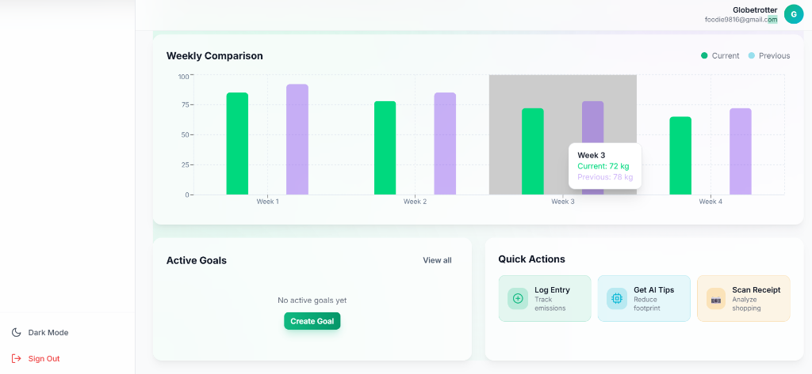
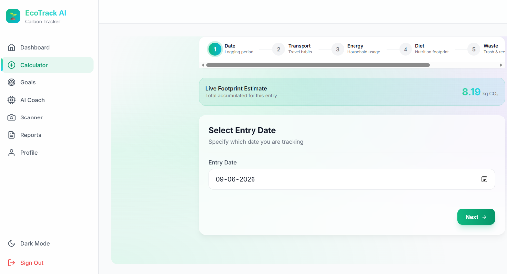
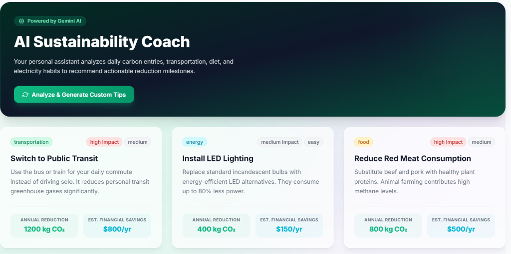
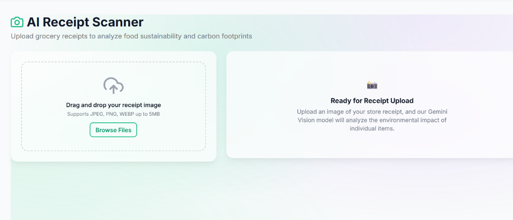
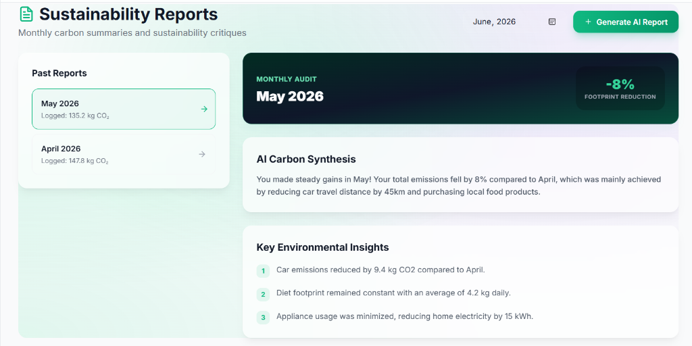
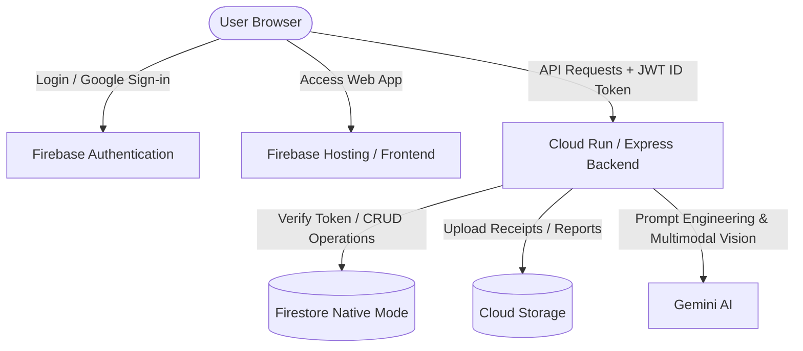

# 🌿 EcoTrack AI — Personal Carbon Footprint Assistant

EcoTrack AI is a modern, cloud-native, full-stack sustainability application designed to help individuals calculate, analyze, and systematically reduce their daily carbon footprints. Powered by **Firebase (Firestore & Authentication)** and **Gemini AI**, it turns data logging into actionable insights and gamified accomplishments.

---

## 🎨 Application Screenshots

### 📊 Interactive Analytics Dashboard
Monitor daily averages, aggregated emissions, weekly trends, and category breakdowns.


### 🚗 Multi-Step Carbon Calculator
A step-by-step logging wizard covering Transportation, Energy, Food habits, and Waste metrics.


### 🤖 Gemini AI Sustainability Coach
Receive tailored lifestyle improvement critiques with projected annual CO₂ and financial savings.


### 📷 Multimodal AI Receipt Scanner
Upload grocery/shopping receipts to analyze packaging, local sourcing, and item-by-item eco-ratings.


### 📄 Monthly Sustainability Audits
Generate detailed monthly carbon progress reports with AI-driven summaries and insights.


---

## 🏗️ Architecture



---

## ⚙️ Tech Stack & Integrations

### Frontend
- **React + TypeScript + Vite**: Ultra-fast single-page web app.
- **Tailwind CSS**: Custom color-tailored visual hierarchy (Forest Mint, Cyber Violet, Nordic Forest Black).
- **Recharts**: Beautiful, fully responsive SVG charts (Area, Donut, and stacked Bar charts).
- **Framer Motion**: Smooth page transitions and floating micro-animations.
- **Firebase Auth**: Secure client-side authorization (Email/Password & Google Sign-In).

### Backend
- **Node.js + Express + TypeScript**: Modular, type-safe REST API server.
- **Firebase Admin SDK**: Secure JWT verification and Firestore document operations.
- **Gemini API (`@google/genai`)**: Large language model for coaching suggestions, monthly report generation, and receipt vision parsing.
- **Vitest**: 100% code coverage on carbon math and gamification scoring.

---

## 📂 Project Directory Structure

```
EcoTrack-AI/
├── client/                     # Frontend SPA (Vite + React)
│   ├── src/
│   │   ├── components/         # Reusable UI & Layout shells
│   │   ├── context/            # Auth, Theme, and Carbon states
│   │   ├── pages/              # Calculator, Coach, Scanner, Reports, Profile views
│   │   └── services/           # API and Firebase Auth client wrappers
│   ├── index.html              # Shell HTML with Google Fonts
│   └── tailwind.config.js      # Mint/Violet design tokens
├── server/                     # Backend API (Express)
│   ├── src/
│   │   ├── config/             # Firestore & Gemini client setup
│   │   ├── controllers/        # Express handlers (AI, Carbon, Users, Goals)
│   │   ├── middleware/         # Security, error filters, validators
│   │   └── utils/              # Carbon formulas and Badge checklists
│   ├── Dockerfile              # Container deployment
│   └── package.json            # Server dependencies
├── images/                     # Readme visual assets
└── package.json                # Root workspaces runner config
```

---

## 🚀 Quick Start & Local Development

### 1. Prerequisites
- **Node.js (v20+)**
- **npm**

### 2. Installation
From the root directory, install all workspace dependencies:
```bash
npm run install:all
```

### 3. Environment Configurations
Rename the templates and populate your API credentials:
- **Server:** Copy `server/.env.example` to `server/.env`
- **Client:** Copy `client/.env.example` to `client/.env`

*Note: If no credentials are provided, the application automatically runs in **Mock Mode** using local in-memory databases and fallback mock data for testing.*

### 4. Running the Dev Servers
Run both backend and frontend servers concurrently:
- **Start Backend:** `npm run dev:server` (running on `http://localhost:3001`)
- **Start Frontend:** `npm run dev:client` (running on `http://localhost:5173`)

### 5. Running Tests
Verify backend carbon calculations and gamification checks:
```bash
npm run test:server
```

---

## ☁️ Deployment Guide

### Backend: Google Cloud Run
Our repository is optimized for serverless deployments.
1. Authenticate the GCP CLI:
   ```bash
   gcloud auth login
   ```
2. Deploy directly from your local source directory:
   ```bash
   gcloud run deploy ecotrack-api \
     --source server \
     --platform managed \
     --region us-central1 \
     --project ecotrack-ai-56ab0 \
     --allow-unauthenticated \
     --set-env-vars "NODE_ENV=production,GEMINI_API_KEY=YOUR_GEMINI_KEY"
   ```

### Frontend: Firebase Hosting
1. Build client assets:
   ```bash
   npm run build:client
   ```
2. Publish to Firebase CDN:
   ```bash
   npx firebase deploy --only hosting --project ecotrack-ai-56ab0
   ```

---

## 🔒 Security Best Practices
- **Credential Protection:** All `.env` and `service-account.json` key files are ignored by `.gitignore` to prevent secret leaks to public repositories.
- **JWT Verification:** Authenticated routes verify Firebase JWT Auth tokens on the server for all requests.
- **Server Security:** Includes Helmet, CORS origin configuration, rate limiters, and express-validator input sanitization.
